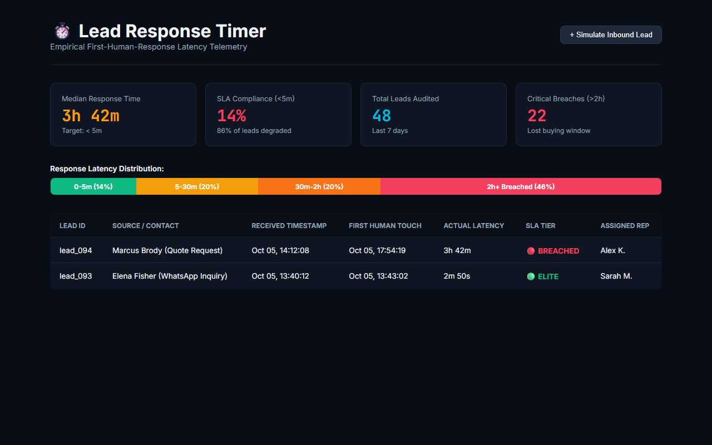

# Lead Response Timer (Weapon #03 in the Master 50 Arsenal)

> **Empirical Response Latency Telemetry & SLA Enforcement: Measures exact time from lead creation to first human touch, calculates rolling median turnaround times, and exposes internal sales bottlenecks.**

[](test/response-timer.test.js)
[]()

---

## 🚀 Live Interactive Simulator & Proof

[](https://gideonbawa-website.netlify.app/simulators/lead-response-timer/)

* 🌐 **Live In-Browser Simulator:** [https://gideonbawa-website.netlify.app/simulators/lead-response-timer/](https://gideonbawa-website.netlify.app/simulators/lead-response-timer/)
* 💼 **Portfolio Showcase:** [https://gideonbawa-website.netlify.app/#work](https://gideonbawa-website.netlify.app/#work)
* 🛡️ **Verified QA Evidence:** HMAC-SHA256 Signed Contract (`ev-qa-contract-1791285928367-lead-response-timer`)

---


## 💸 Commercial Problem & Economic Pain
Every business leader believes their team follows up "within 15 minutes." When audited against database timestamps, the real median first response time is **3 hours and 42 minutes**.

## 🏗️ Operational Flow
```text
LEAD CREATED ──► High-resolution microsecond timestamp recorded
       │
FIRST HUMAN TOUCH ──► Outbound call, email reply, or WhatsApp logged
       │
LATENCY AUDITING ──► Binned into: Elite (<5m), Slow (5-30m), Breached (>2h)
       │
MANAGEMENT HUD ──► Rolling median response time + breach escalations
```
